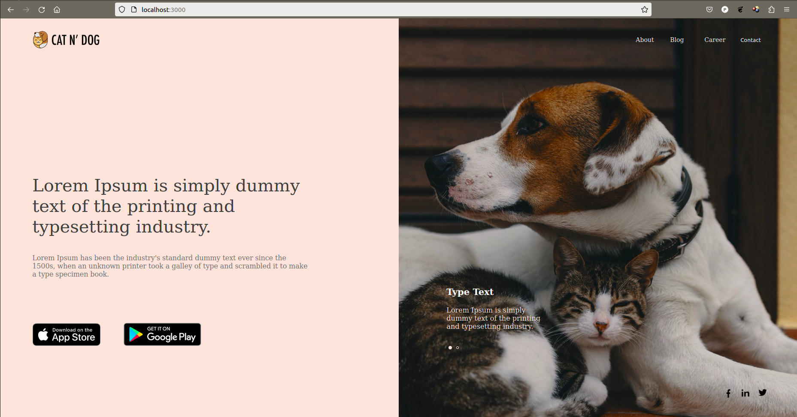
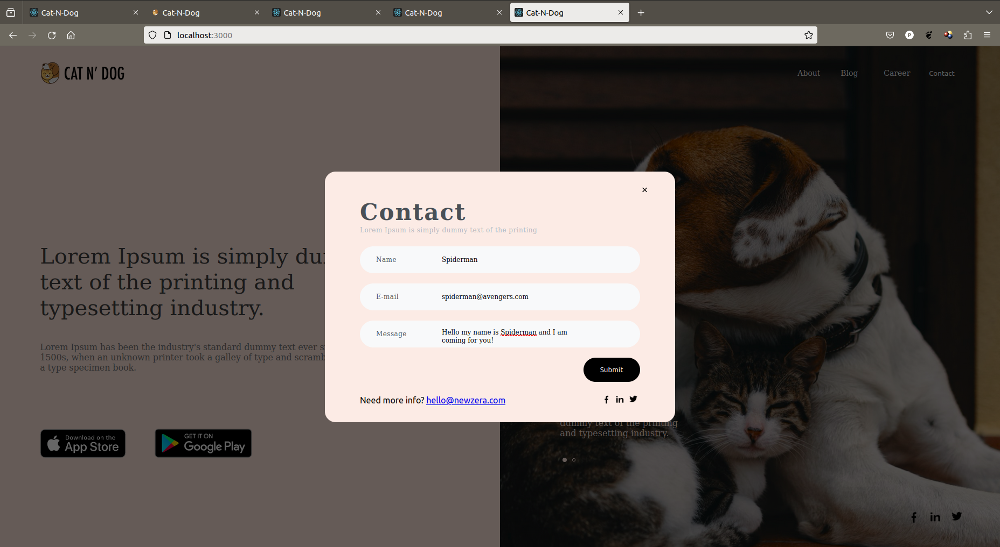
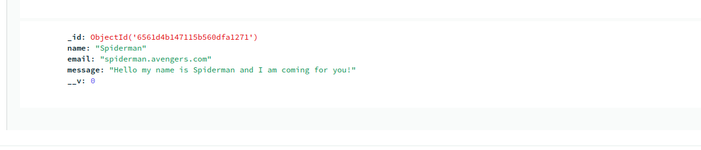

# Intro
This is a fullstack implementation of a simple website made using react and graphql.

* The website contain a single web page, with two different images used for image slider.
* There is a popup that opens on clicking the Contact option in the navbar.
* The info entered here will be sent to the server using apollo graphql.
* The server will store it on mongodb.

<figure>
    
    <figcaption> Fig 1 - Website Home Page </figcaption>
</figure>

<figure>
    
    <figcaption> Fig 2 - Contact Modal </figcaption>
</figure>

<figure>
    
    <figcaption> Fig 3 - Request reflected in MongoDB database </figcaption>
</figure>